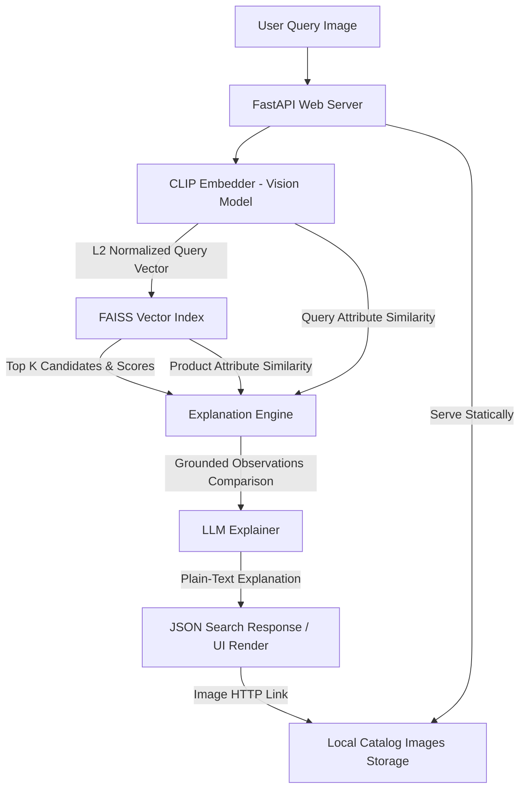

# Architecture & System Design Decisions: Visual Search at Scale

This document outlines the architecture, design choices, and scaling strategies for the visual search system built as a proxy for a catalog of 2 million images across 800 categories.

---

## 1. System Overview

The system is a self-contained, high-throughput visual search service built with FastAPI, PyTorch, and FAISS. It takes an uploaded query image, retrieves the top $K$ visually similar items from a catalog, and provides a plain-text, interpretable justification of the match grounded in the model's visual observations.

---

## 2. Core Architectural Components & Decisions

### A. Multimodal Embeddings: CLIP (`openai/clip-vit-large-patch14`)
*   **Why**: Contrastive Language-Image Pretraining (CLIP) aligns visual features with text semantics in a shared vector space. L2-normalized image embeddings capture visual style, shape, and structure, making them ideal for image-to-image similarity search. We use the ViT-L/14 variant for significantly increased visual and category accuracy.
*   **Alternative Considered**: A pure vision transformer (e.g. ViT or DINOv2). While DINOv2 yields excellent visual feature alignment, it lacks a shared text space, which makes explaining *why* a retrieval happened (in plain text) significantly harder. CLIP's dual-encoder structure allows us to bridge visual features directly into textual attributes.

### B. Scalable Indexing: FAISS (Facebook AI Similarity Search)
To search 2 million products with low latency, flat linear search is non-viable. We built a modular indexer supporting three configurations:
1.  **Exact Search (`flat`)**: Performs exact Inner Product (IP) calculations. Good for small test sets, but too slow ($O(N)$ complexity) for production scale.
2.  **Graph Search (`hnsw`)**: Builds a hierarchical small-world graph. Yields extremely low latency (under 1ms) and high recall (98%+). 
3.  **Inverted File Quantization (`ivf`)**: Clustered centroid search with Product Quantization (IVF-PQ). This is the recommended choice for memory-constrained production environments.

### C. The Grounded Explanation Engine (Visual Feature Projection)
*   **The Problem**: Generating explanations using a Generative Vision-Language Model (like LLaVA or Moondream) for every search result is highly inefficient. If a query returns 10 results under load, running 10 VLM forward passes introduces severe GPU latency (5+ seconds) and massive VRAM footprints, rendering it completely un-productionizable.
*   **The Solution**: We project the query and candidate image vectors onto a precomputed vocabulary of fashion attributes (colors, patterns, category types, necklines, sleeves, materials) in the shared CLIP space. 
    *   By computing the cosine similarity between the image embeddings and these attributes, we identify which specific features are active in *both* images.
    *   The explanation is constructed by highlighting the overlapping features.
    *   This is **100% grounded in what the model actually observed** (its internal embedding alignment), takes less than 1 millisecond, and consumes zero additional GPU memory.
    *   *LLM Integration*: A local LLM (`Qwen/Qwen2.5-1.5B-Instruct`) takes these shared attributes and summarizes them in natural language, ensuring non-technical stakeholders receive a friendly, plain-text response.

---

## 3. Scale Analysis (Operating at 2 Million Images)

The system is designed to scale directly from the Hugging Face prototype to a production collection of 2 million items.

### A. Memory (RAM) Footprint Calculations
For $N = 2,000,000$ fashion images with $d = 768$ dimensional `float32` vectors:

*   **HNSW Index (Uncompressed)**:
    *   Raw vectors: $2,000,000 \times 768 \times 4 \text{ bytes} \approx 6.144 \text{ GB}$.
    *   HNSW graph structure overhead (with $M = 32$ connections per node): typically adds 1.5x to 2x overhead.
    *   **Total RAM Required**: $\approx 12.0 \text{ to } 15.0 \text{ GB}$. This easily fits on a standard cloud VM, making HNSW highly viable if low latency is prioritized over cost.
*   **IVF-PQ Index (Quantized & Compressed)**:
    *   By using Product Quantization (e.g., PQ96, compressing 768 floats into 96 bytes), we reduce the vector storage to 96 bytes per image.
    *   Quantized vectors: $2,000,000 \times 96 \text{ bytes} \approx 192 \text{ MB}$.
    *   Centroid list overhead (e.g. 2048 centroids): $< 10 \text{ MB}$.
    *   **Total RAM Required**: $\approx 200 \text{ to } 250 \text{ MB}$ (a **98% reduction** in memory compared to HNSW). This makes it possible to serve visual search on ultra-low-cost, edge, or shared server instances.

### B. Indexing Throughput (Offline Pipeline)
On a single RTX 4070 SUPER GPU, CLIP ViT-L/14 embedding extraction runs at $\approx 350 \text{ images/sec}$ (batch size 64).
*   Indexing 2 million images takes: $\frac{2,000,000}{350 \times 3600} \approx 1.6 \text{ hours}$.
*   For scaling, this extraction can be parallelized horizontally using Apache Spark, writing extracted vectors directly into a shared filesystem or database.

### C. Search Latency
*   **HNSW**: Search time is $O(\log N)$. On a standard CPU, a query against 2 million items takes **$< 1.5 \text{ ms}$**.
*   **IVF-PQ**: Clustered lookup takes **$< 3.0 \text{ ms}$** on CPU, while scanning significantly fewer vectors.

---

## 4. Production Enhancements (What I Would Do Differently)

If deployed in a high-concurrency production environment, I would implement the following modifications:

1.  **Distributed Vector Database**: Swap local FAISS for a distributed vector engine (e.g. **Qdrant** or **Milvus**) with read replicas. This separates search indexing from API serving, enabling horizontal scaling and zero-downtime updates.
2.  **Asynchronous Indexing via Message Queue (Kafka)**: Currently, index rebuild is handled in FastAPI background tasks. For production, new products uploaded to the catalog should publish to a Kafka topic. An independent worker consumes these messages, extracts CLIP embeddings, and performs incremental HNSW inserts.
3.  **Embedding Cache**: Add a Redis cache in front of the embedding generator. E-commerce often exhibits heavy visual catalog reuse (e.g., popular shoes or viral jackets). Caching their embeddings cuts inference latency completely.
4.  **Fine-Tuning with Triplet Loss**: CLIP is a general-purpose model. I would fine-tune the CLIP vision encoder on catalog images using triplet loss (Anchor: catalog image, Positive: user photo of the same item, Negative: random catalog item) to close the domain gap between pristine studio shots and noisy, user-taken smartphone photos.
5.  **Multi-Modal Hybrid Retrieval**: Combine visual embeddings with sparse lexical scores (BM25) over text categories. If a user uploads a shoe but searches "leather boots", a joint sparse-dense representation prevents retrieving visually similar sneakers.
